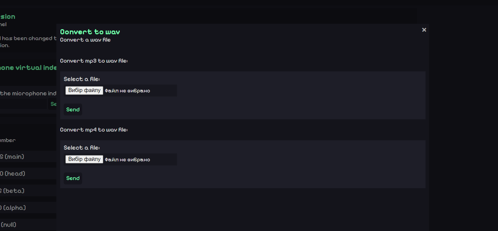

# Sound program

The Sound program is an analog of Soundpad (just worse). It allows you to play sounds through a virtual microphone.

## Launch
Run the following command to build the executable:

```
pyinstaller --onefile name.pyw
```

You also need to install a virtual microphone:
install/virtual_audio_cable_v4.67.exe

## img



